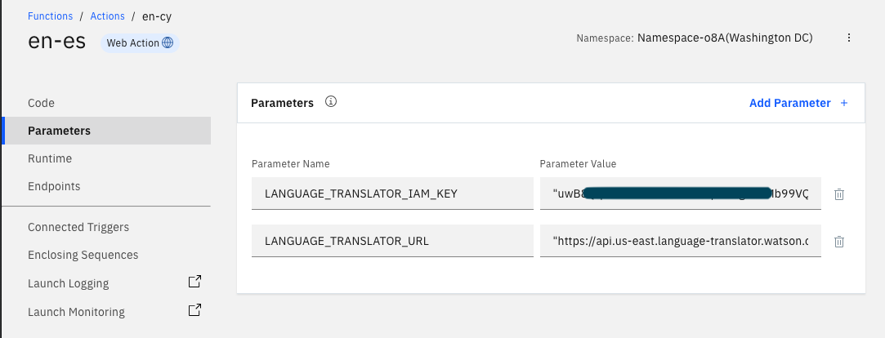

# Functions to Functions
_A simple example of porting an IBM Cloud Functions action to IBM Cloud Code Engine Functions_

With the deprecation of [IBM Cloud Functions](https://cloud.ibm.com/docs/openwhisk?topic=openwhisk-dep-overview) we are recommending that all customers migrate their Functions actions, triggers, and sequences to [IBM Cloud Code Engine](https://ibm.com/products/code-engine). Code Engine is a modern "serverless" platform with support for multiple workload types: run to completion jobs, long running applications, and classic serverless functions. Most Cloud Function actions are small code snippets that act as either a simplified API or as "glue logic" between applications and online services. In this example we'll migrate a Function action that uses Watson Machine Language Translator to translate text from one language to another.

## The As-Is System

The existing application is a web based application that supports translating English text into Spanish. The web app is actually a front end to Watson Assistant (IBM's chat bot technology). Model training and replies are in English but the web app offers the ability to click a button and translate the reply into Spanish for native speakers.

IBM Cloud Functions is used to wrap the API call to Watson Machine Language Translator. Translation calls require an security credentials that you don't want to expose in an HTML page so wrapping the call in a Function is a quick and simple way to provide authenticated access to the Translator service. Here is the existing Function action:

```javascript
/**
  *
  * main() will be run when you invoke this action
  *
  * @param Cloud Functions actions accept a single parameter, which must be a JSON object.
  *
  * @return The output of this action, which must be a JSON object.
  *
  */
async function main(params) {
    const LanguageTranslatorV3 = require('ibm-watson/language-translator/v3');
    const { IamAuthenticator } = require('ibm-watson/auth');

    const languageTranslator = new LanguageTranslatorV3({
        version: '2018-05-01',
        authenticator: new IamAuthenticator({
        apikey: params.LANGUAGE_TRANSLATOR_IAM_KEY,
    }),
    serviceUrl: params.LANGUAGE_TRANSLATOR_URL,
    });

    const translateParams = {
    text: params.input || "there was no input passed in",
    modelId: 'en-es',
    };

    var obj;

    await languageTranslator.translate(translateParams)
    .then(translationResult => {
    obj = translationResult;
    })
    .catch(err => {
    console.log('error:', err);
    });

    return obj.result;
}
```

This action is exposed as a `web action` and has a URL endpoint for HTTP POST requests. The caller passes in the text to translate in the `params` payload with the key name `input`. Environment variables for the Language Translator API key and URL endpoint are used to connect to the service. The translated text is sent back to the caller.

This code was just pasted into the Functions UI. IBM Cloud Functions uses a standard nodejs runtime that already has the Watson API libraries loaded and available. So the programmer didn't have to fiddle with a `package.json` file or any kind of nodejs build process. The environment variables are set in the Parameters section of the action and are automagically passed in with the payload.



So, 25 lines of code and two environment variables defined in the UI. Easy peasy.

## Porting to Code Engine

Code Engine support multiple workload types: applications, jobs, and functions. The [difference between these](https://cloud.ibm.com/docs/codeengine?topic=codeengine-cefunctions) largely amounts to how long running the workload is, whether it is intended to respond to HTTP requests, and the transactional volume of calls expected. See the Code Engine docs for more details comparing the different workload types. For this migration we will use Code Engine Functions as it provides the closest 1-1 match with the existing code snippet.

There are a couple of key differences between a Code Engine (CE) Function and an Functions action here.

- CE Functions are always web actions. The HTTP response header should be used to set the `Content-Type` of the response to `application/json` or what have you.
- The CE Functions runtimes do not come with a large pre-installed set of libraries. You have to create your own container with the needed libraries or use the "source to code" capabilities within CE.
- You need to explicitly export the main() function so it is visible to the CE Functions runtime.
- Environment variables are not available in the payload but are passed in through the normal operating system support of the programming language chosen. In nodejs this means that environment variables are available in the `process.env` object as key/value pairs.

With that said, there are only a couple of lines of difference between the original source and the CE Functions code. Here's the new code, stored in the file `main.js`:

```javascript
async function main(params) {
    const LanguageTranslatorV3 = require('ibm-watson/language-translator/v3');
    const { IamAuthenticator } = require('ibm-watson/auth');

    const languageTranslator = new LanguageTranslatorV3({
        version: '2018-05-01',
        authenticator: new IamAuthenticator({
        apikey: process.env.LANGUAGE_TRANSLATOR_IAM_APIKEY
    }),
    serviceUrl: process.env.LANGUAGE_TRANSLATOR_URL,
    });

    const translateParams = {
    text: params.input || 'Hello, world',
    modelId: 'en-es',
    };

    let obj = {};

    await languageTranslator.translate(translateParams)
    .then(translationResult => {
    obj = translationResult;
    })
    .catch(err => {
    console.log('error:', err);
    });

    return {
        statusCode: 200,
        headers: {
            'Content-Type': 'application/json',
        },
        body: obj.result
    }
}

module.exports.main = main;
```

There are only minor differences here compared to the original code. The environment variables are available in `process.env` and the return result is a proper HTTP result with status code, header, and body.

## Building the New Code

Code Engine Functions support a simple GUI editor where you can write or paste code snippets into. This looks very similar to the editor in IBM Cloud Functions. Unfortunately, this cannot be used here because the nodejs runtime supported in Code Engine doesn't already have the Watson libraries included. In other words, there is no place to specify a `package.json` file or provide a `node_modules` directory.

So instead we'll do this in two parts: we'll use the UI to store the environment variables and we'll [use the CLI](https://cloud.ibm.com/docs/codeengine?topic=codeengine-fun-tutorial) to create a container image from source code for the function.

Here's a screenshot of the environment variables needed to connect to Watson Machine Language Translator:


Here I created a project, _dc-wx-001_, and have a function `en_es` within that project. In the environment variables UI tab I have the credentials needed to talk to Watson Machine Language Translator. This is slightly different terminology than in IBM Cloud Functions but is basically the same as the "parameters" section.

In a normal production setting I would have my code checked into a github repository or the like and would use Code Engine's build tools to create a container image. Here we are going to take a short cut and just keep the code in a folder on my laptop and build the image direct from source.

To create (or update) the function you'll need the [IBM Cloud CLI](https://cloud.ibm.com/docs/codeengine?topic=codeengine-install-cli) and the Code Engine plugin to the CLI. Let's assume you have a folder `~/dev/langtranslator/` where your file `main.js` (i.e. your functions code snippet) is. Navigate to the folder and using the IBM Cloud CLI run the following command:

`ibmcloud ce function create -n en-es -runtime nodejs-18 --build-source .`

You'll get output similar to this:

```bash
~/dev/langtranslator $ ibmcloud ce function create -n en-es -runtime nodejs-18 --build-source .
Preparing function 'en-es' for build push...
Updating function 'en-es'...
Packaging files to upload from source path '.'...
Submitting build run 'en-es-run-240223-114032411'...
Creating image 'private.jp2.icr.io/ce--24764-1ciooedwd9jb/function-en-es:240223-1640-kav12'...
Waiting for build run to complete...
Build run status: 'Running'
Build run completed successfully.
Run 'ibmcloud ce buildrun get -n en-es-run-240223-114032411' to check the build run status.
Waiting for function 'en-es' to become ready...
Function 'en-es' is ready.
OK                                                
Run 'ibmcloud ce function get -n en-es' to see more details.

https://en-es.1ciooedwd9jb.us-east.codeengine.appdomain.cloud
~/dev/langtranslator $ 
```

_NOTE: if you later need to update the source code you would use `ibmcloud ce fn update ...` as the CLI command. "fn" is just a shortcut for "function" and "update" is used when you have already done a `create`._

Done. That's it. You can now call the URL endpoint provided passing in the text with the _input_ parameter and it'll be translated. In the same above if you do not pass in any input, the function translates "hello world".

## Summary

Most IBM Cloud Functions actions port directly over to Code Engine functions or Code Engine applications with little modifications. In general, Code Engine uses and exposes the runtime programming environment more directly so you need to explictly include HTTP status codes and headers but the actual business logic of your code should be the same. The build process in Code Engine is more flexible and powerful but can also be a little more confusing. For simple code snippets building from the CLI with a single line command works in most cases. See the [Code Engine docs](https://cloud.ibm.com/docs/codeengine?topic=codeengine-getting-started) for more details.
